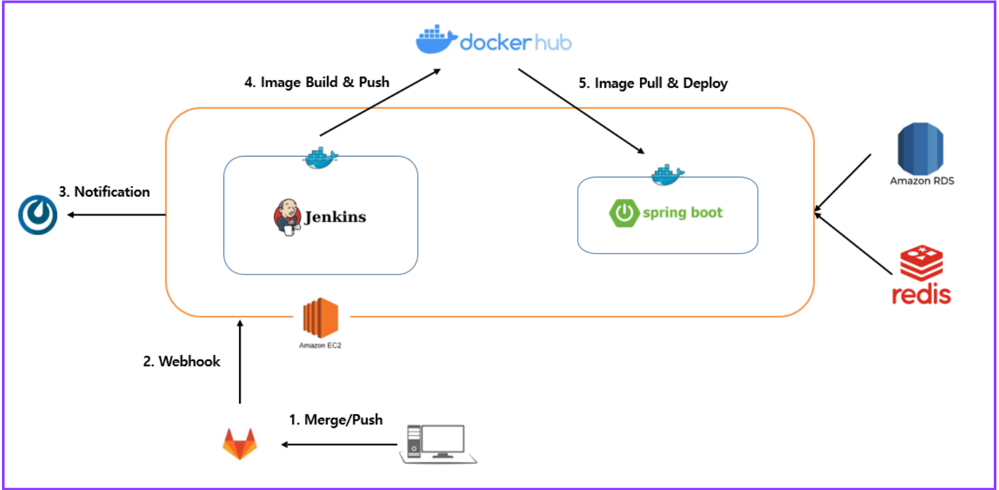
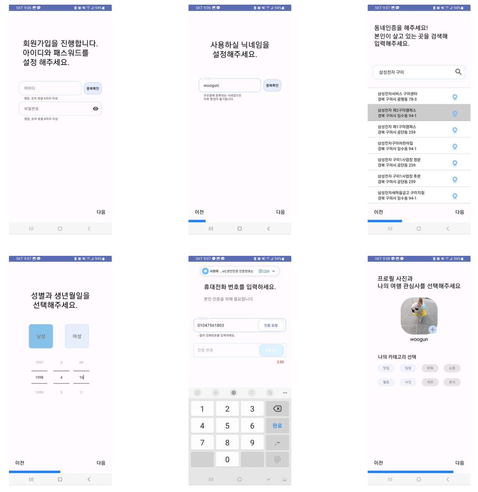
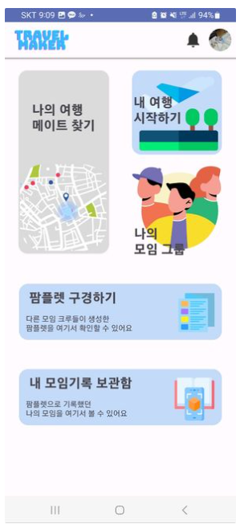
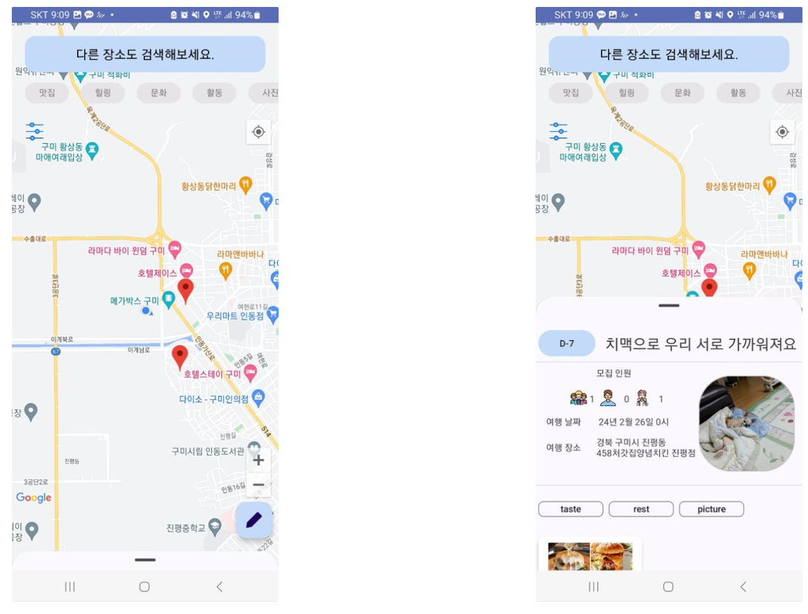
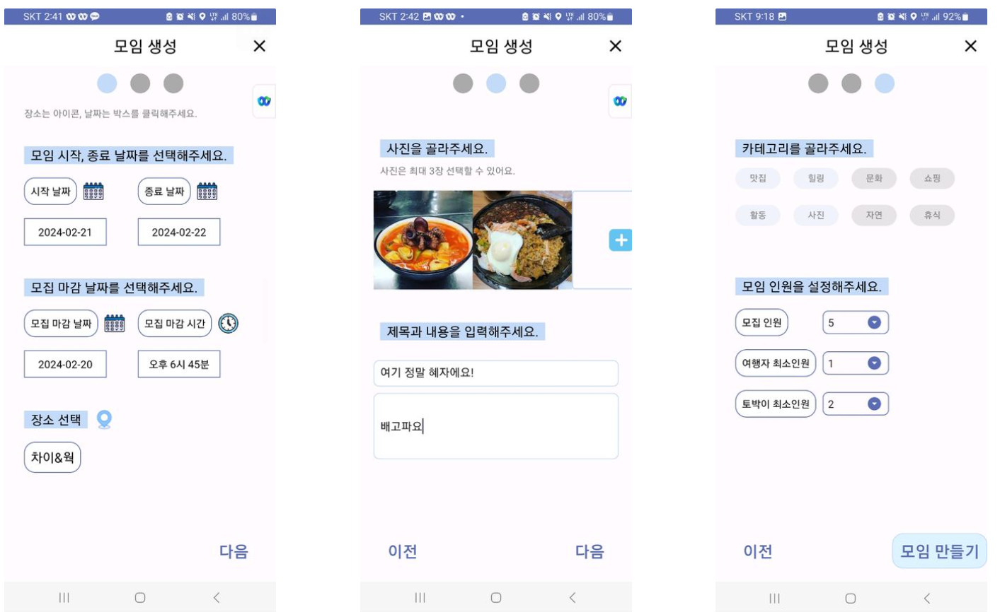
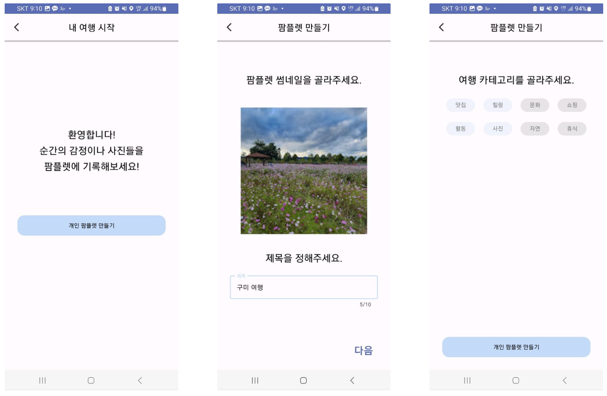
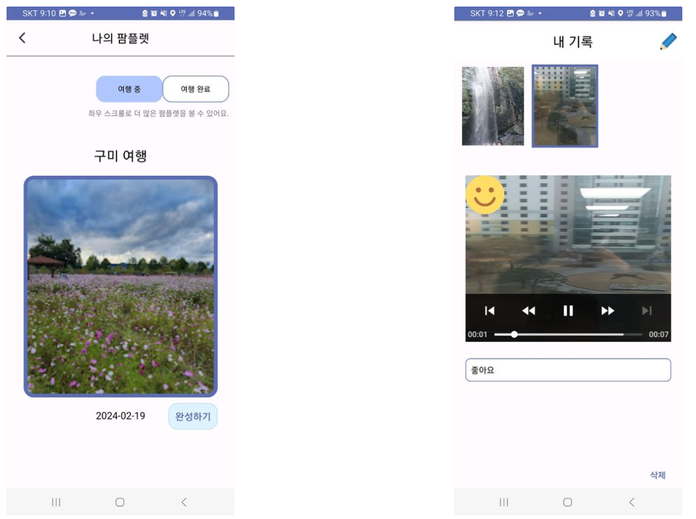
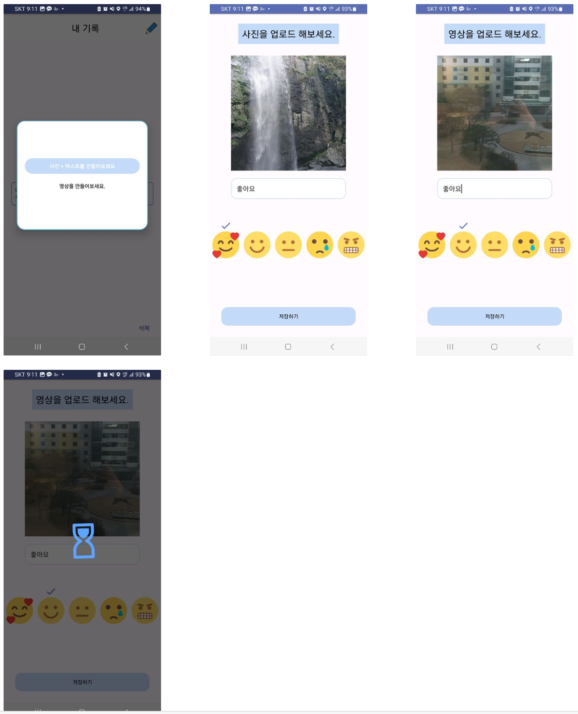

# SSAFY10th 구미2반 D202 공통 프로젝트 
## 구미의 봄 

 팀 노션 링크
https://gilded-waiter-906.notion.site/d7abea5099a14b018f8b12a37a26fac4

## 🗼 TravelMaker 소개
- TravelMaker는 사용자가 여행을 떠났을 때 그 여행지의 **로컬 현지인과의 만남**을 쉽게 할 수 있도록 도와주고 그 **만남의 추억을 편하게 기록**을 할 수 있게 도와주는 서비스 입니다.

### 🖥️ Android 개발 환경

IDE: Android Studio Flamingo 2022.2.1

Gradle : 8.0.2

JDK: Jbr 17 

Kotlin-version : 1.7.20

Target SDK : 33

### 📖 Android 라이브러리 및 외부 API 사용
|Name|Version|License|
|------|---|---|
|Android Jetpack||Apache License 2.0|
|Retrofit2|2.9.0 ver|Apache License 2.0|
|Hilt|2.44 ver|Apache License 2.0|
|Glide|4.12.0 ver|Apache License 2.0|
|ExoPlayer2|2.15.1 ver|Apache License 2.0|
|Lottie|5.0.2 ver|MIT License|
|Firebase|30.1.0 ver|Apache License 2.0|
|Google Map|18.0.2 ver||
|Google Geocoding API|2.44 ver||
|Kakao Local API|2.44 ver||

### 🖥️ BackEnd 개발 환경

IDE: IntelliJ IDEA 2023.2.5

JDK: Jbr 17 

Spring Boot: 3.2.1

### 📖 BackEnd 라이브러리 및 외부 API 사용
|Name|Version|License|
|------|---|---|
|Jasypt|3.0.4 ver|Apache License 2.0|
|Json Web Token|0.11.5 ver|CDDL License 1.0|
|AWS Cloud|2.2.6 ver|Apache License 2.0|
|Firebase Admin|9.2.0 ver|Apache License 2.0|
|Nurigo API|4.3.0 ver|Apache License 2.0|
|Spring Doc|2.0.2 ver|Apache License 2.0|
|Spring Security|6.2.2 ver|Apache License 2.0|
|Redis|3.2.3 ver|Apache License 2.0|
|Lombok|1.18.30 ver|MIT License|

### ERD

### 시스템 구성도

## 주요 기능

### 🔎 회원 가입

💡 회원 가입에서의 주요 기능은 동네인증 기능과 휴대폰 번호 인증 기능입니다.

### 🔎 Home 화면

💡 Home 화면은 Lottie 애니메이션을 사용하여 사용자에게 생동감 있는 UI/UX 경험을 주도록 하였습니다.

### 🔎 나의 여행 메이트 찾기

💡 나의 여행 메이트 찾기 화면에서는 구글 맵이 나타납니다. 구글 맵의 마커는 앱을 사용하는 사용자가 해당 위치에서 모임 모집글을 올렸다는 것을 나타냅니다.

### 🔎 모임 생성

💡 구글 지도에서 Floating Button을 누르면 모임을 생성할 수 있습니다. 

### 🔎 나의 모임 그룹

💡 나의 모임 화면에서 내가 신청한 모임과 내가 만든 모임의 목록을 확인할 수 있습니다.

### 🔎 팜플렛 만들기(내 여행 시작하기)

💡 모임을 통한 여행을 기록하기 위해 팜플렛을 만드는 화면입니다.

### 🔎 내 모임 기록 보관함, 상세 화면 

💡 Home 화면에서 내 모임 기록 보관함을 클릭하고 들어오면 위에서 만든 팜플렛에 세부 내용을 기록할 수 있습니다.

### 🔎 팜플렛 기록하기

💡 이미지 or 비디오는 갤러리에 접근하여 이미지 썸네일을 렌더링 합니다.

### 🔎 팜플렛 구경하기

💡 내가 아닌 다른 사용자의 팜플렛을 구경할 수 있습니다.

## 팀원 소개

